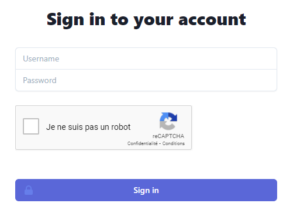

# STI Project 1 - User Manual
Authors: Bécaud Arthur & Egremy Bruno
## Pages list
| Page           | URL                               |
|----------------|-----------------------------------|
| Login          | http://localhost:8080/login.php   |
| Mailbox*       | http://localhost:8080/mailbox.php |
| Profile*       | http://localhost:8080/profile.php |
| Administrator* | http://localhost:8080/admin.php   |

** Require to be logged in to access the page.*
## Login
The login page is the default page. You will be redirected to this page if you try to access another page in the above list. To access this page from another context, you can click on the 'MailBox' element in the sidebar.
The page has been updated and now use reCaptcha to block bruteforce attacks.

## Mailbox
The Mailbox page will be the first page you see after signing in. You will see a list of email in the right side of the page where you can show, respond or delete an email. To access this page from another context, you have to click on the 'MailBox' element in the sidebar.

The 'Show' button show the content of a given email and the 'Respond' button open a response form. The 'Delete' button delete the email without a warning, be sure of what you're doing before pressing this button.

If you left click on 'WRITE A NEW MESSAGE' a form appear where you can select a receiver and write your email.

## Profile
To access this page, you have to click on your username ('PATRICK' on the following figure) in the sidebar.

You can change only change your password on the profile page. The policy of the password have been improved you now have to use a password of at least 8 characters containing 1 Upper Case letter, 1 number and 1 special character. 

## Administrator
To access this page, you have to click on the 'Manage Users' element in the sidebar. You will see a list of user in the right side of the page where you can change their role, their activity status and their password as well as deleting them.

The role and validity can be change be clicking on the current role or validity of a user. When clicking on the 'Change password' button, a form appear where you can write a new password.

If you left click on 'ADD A NEW USER' a form appear where you can create a new user with a username, a password, a validity and a role.

